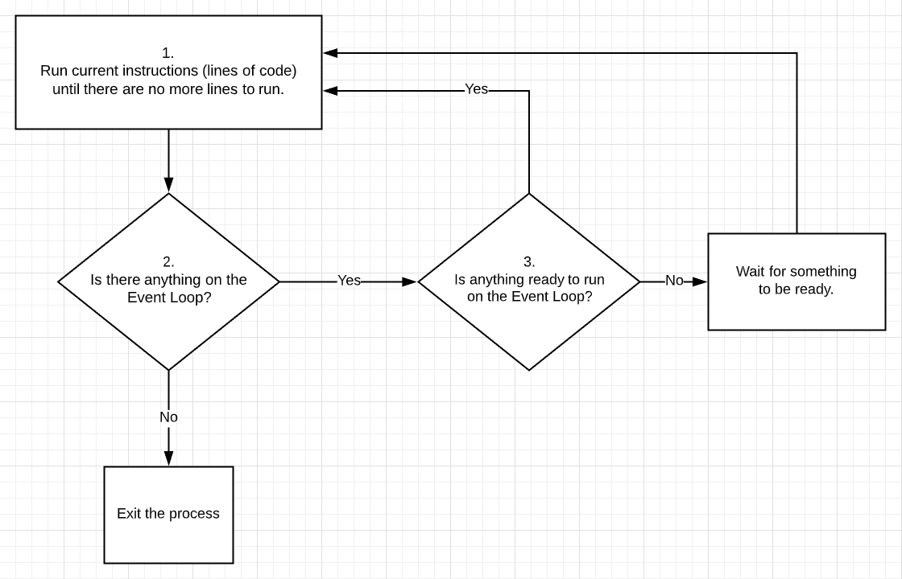

# Processes, CPU's, and Threads

- Today's CPU's offer multiple cores.

- Some CPU's only offer single threads. Some CPU's offer hyper threading (two threads per processor).

- Each thread can run one process at a time.

- CPU's are very good at swapping very quickly what process is being run. Instead of multi-tasking each thread runs one process for a few milliseconds, then another, etc.

- Each thread offers a finite amount of processing power.

# The Event Loop

JavaScript runs on a single process, but it assigns out work for other processes to do. This gives JavaScript the power of multi-threaded processing without dealing with the insane complexities of multi-threaded applications.

Here is how JavaScript runs:

1. Run current instructions (lines of code) until there are no more lines to run.

2. Check to see if there is anything ready on the event loop. If so run the next item on the loop (go back to step 1).

3. If there is something on the event loop but its not ready then wait until something is ready.

# An Introduction to the NodeJS FS Core Module

- We are going to create a JavaScript file that reads a file.

- First read a file using [fs.readFileSync](https://nodejs.org/api/fs.html#fs_fs_readfilesync_file_options). This is a synchronous blocking operation.

- Next read a file using [fs.readFile](https://nodejs.org/api/fs.html#fs_fs_readfile_file_options_callback) that uses a callback. This is an asynchronous non-blocking operation.

- Notice that the callback gets two parameters: error and data.

<--

We are passing a callback function to `fs.readFile`. How does our callback function get called?

--

The callback is being called by `fs.readFile` once it has read the file.

-->

<--

What decides the parameters the callback function will be called with, the callback function itself or `fs.readFile`? Why?

--

`fs.readFile` is the calling function so it gets to decide which parameters it will send to our callback function. Remember that the calling signature does not need to match the function definition's signature.

-->

## Examples

There are some examples files we can use to look more into the behaviour of synchronous vs asynchronous functions.

- Use git to clone the repository: `https://github.com/Gi60s/it410-resources.git`

- Navigate into the directory: `async`

- We need to initialize the files. Run the command: `node 0-make-files`

- This will generate three large files (`small.txt`, `medium.txt`, and `large.txt`) into the `async/files` directory.

- You will probably want to delete these files when we're done with the examples.

### Example 1

- File name: `1-sync.js`

- This will read each of the files using synchronous blocking functions.

- The time to read each file will be output (in milliseconds) as well as the total time.

- Run the example: `node 1-sync`

### Example 2

- File name: `2-async.js`

- This will read each of the files using asynchronous non-blocking functions.

- The time to read each file will be output (in milliseconds) as well as the total time.

- Run the example: `node 1-sync`

<--

There is something wrong with the output. Can you tell what the code did wrong?

--

The event queue had not yet resolved the asynchronous requests when we logged the total time.

-->

### Example 3

- File name: `3-event-queue.js`

- This will add an event to the event queue that should run after 100 milliseconds, as soon as the process is idle.

- The event will trigger a function call that will output the delay.

- Run the example: `node 3-event-queue`

### Example 3 Part 2

- Now uncomment the synchronous blocking call to read the large file.

- Run the example again and observe the change in time.

- The event appeared on the event queue at 100 milliseconds but the process was busy for a while before it could fire the event's callback function.

### Example 4

- File name: `4-async.js`

- Will load all three files asynchronously and output the time for each as well as the total time.

- Run the example: `node 3-event-queue`

<--

Why wasn't this any faster than the synchronous blocking code?

--

We didn't start to read the next file until the previous had finished. We didn't block the process so it could have done other things, but it waited on the previous file before loading the next file.

-->

<--

How can we read all three files simultaneously and report their load times and the total read time?

--

Look at the example in `5-async.js`.

-->

# Promises

- Callbacks provide a nice way to use asynchronous functions.

- Unfortunately they can create the "pyramid of doom" a.k.a. "callback hell".

- Under complex conditional asynchronous programming they become difficult to manage flow.

- Promises resolve these issues.
