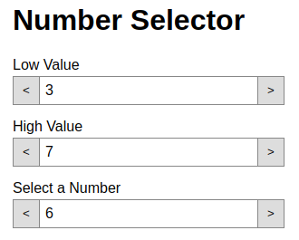

## About Vue Components

- A Vue component is a reusable piece of HTML, CSS, and JavaScript.

- Components can accept inputs via HTML attributes.

- Components may allow inner HTML content via slots.

- Component data and methods are accessible via JavaScript.

- Components can be nested within other components.

- When you initialize a Vue app, you create a root component that nests all other components within it.

## Documentation: 

The Vue documentation is good, especially the Guide. Use the documentation provided there to complete the exercise below.

- [Vue Component Basics](https://vuejs.org/v2/guide/components.html)

- Also see the **Components In-Depth** in the navigation menu on that page for more documentation about how to use components.

# Exercise

1. Clone the starter app for building a number picker component: `git clone git@github.com:Gi60s/it410-vue-component-number-picker.git`

2. Install the dependencies: `npm install`

3. Open the `App.vue` and `NumberPicker.vue` file. You'll work on these, probably starting with `App.vue`. Follow the steps in comments for each file.

4. In the end you're app should look something like this:

